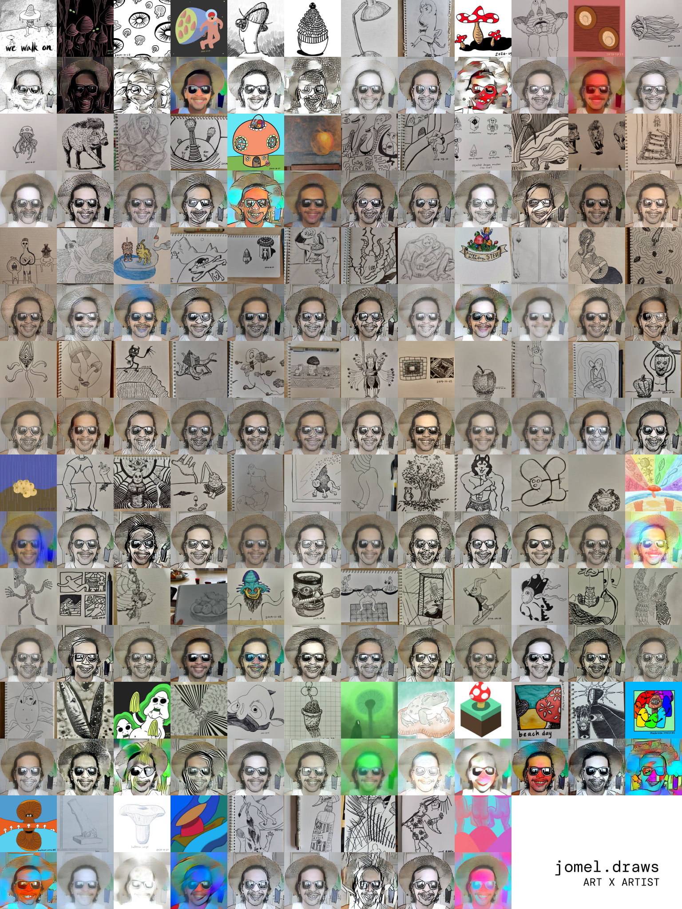

# jomel.draws

Applied styles from Jomel's drawings in Instagram over his portrait photo using [neural-style-pt](https://github.com/ProGamerGov/neural-style-pt)



## Run

1. Install dependencies

    ```
    python3 -m venv .venv
    source .venv/bin/activate
    pip3 install neural-style torch==1.8.1 torchvision==0.9.1
    pip3 install colorthief spectra
    ```

2. Download images. I created the list by inspecting network calls from Jomel's IG page.

    ```
    (cd style_images && wget -i jomel.draws.txt && python3 ../clean_ig_filenames.py)
    ```

3. Run neural-style on downloaded images

    ```
    python3 models/download_models.py
    sh run.sh
    ```

4. Render collage image

    ```
    python3 render_canvas.py
    ```